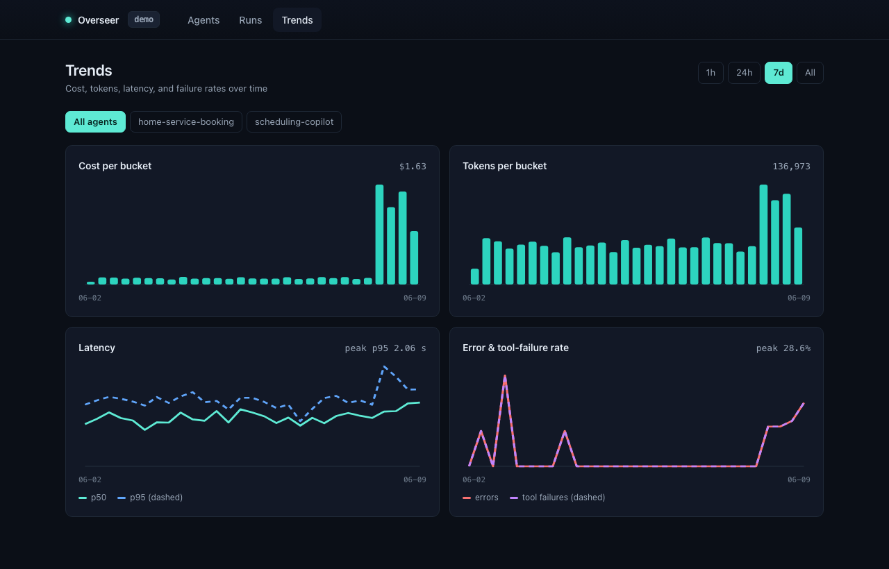
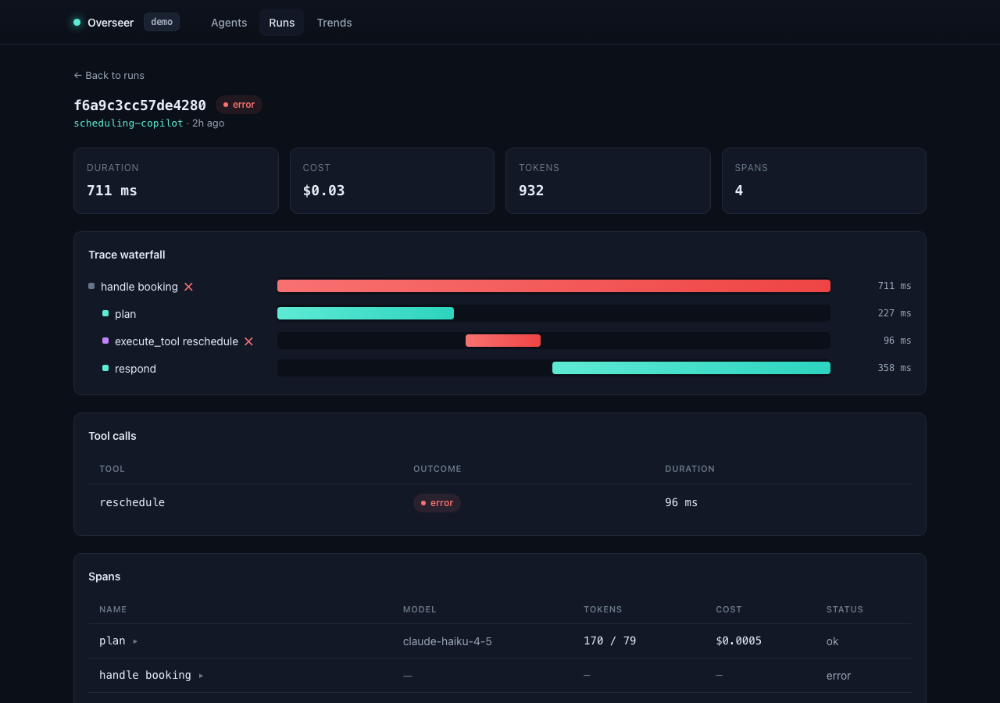

# Overseer for Agents

[](https://github.com/cornhusk39/overseer-for-agents/actions/workflows/ci.yml)
[](LICENSE)

Self-hosted observability for production LLM agents. Send traces in over
standard OpenTelemetry, get agent-native metrics out: cost, tokens, tool-call
success, latency percentiles, error and tool-failure rates, live run
waterfalls, and threshold alerts to Discord or Slack. One `docker compose up`
runs the whole plane, and no prompts or customer data ever leave your
infrastructure.

```
  your agent ──OTLP/HTTP JSON──▶  ingest  ──▶  SQLite  ──▶  dashboard
   (any OTel SDK, or the         redact,        per-run       waterfalls,
    bundled TS client)           cap, map       rollups       trends, alerts
```



## The problem

Teams that ship LLM agents can usually answer "did it pass eval," but not
"what is it doing in production right now." Costs drift, a tool call quietly
starts failing, latency creeps, and nobody notices until a customer does.
Generic APM doesn't understand agent semantics (steps, tool calls, tokens,
model cost), and hosted LLM observability platforms are a non-starter for
teams that can't ship prompts and customer data to a third party.

Overseer is the missing middle: an observability plane that speaks agent,
runs on your own box, and stands up in one command.

## Why not a hosted platform (or Langfuse)

1. **Agent-native, not prompt-native.** Tool-call success and multi-step run
   health are first-class. The waterfall, the per-run rollup, and the alert
   metrics are built around how agents actually fail.
2. **Standards-first.** Ingestion is OTLP/HTTP with the GenAI semantic
   conventions (`gen_ai.*`) mapped to agent-native fields. No proprietary
   protocol; attributes Overseer doesn't recognize are preserved, not dropped.
3. **Self-host-first.** A single compose file, SQLite, no external services.
4. **Eval interop.** Overseer natively reads the
   [AgentProbe](https://github.com/cornhusk39/agentprobe) trace schema, so
   eval and production observability form one toolchain: cassettes recorded
   on the eval side import as runs on the observability side.

## Quickstart (self-host)

Prerequisites: Docker.

```sh
git clone https://github.com/cornhusk39/overseer-for-agents.git
cd overseer-for-agents
cp .env.example .env            # then set OVERSEER_INGEST_TOKEN, e.g. $(openssl rand -hex 32)
docker compose up --build
```

- Dashboard: http://localhost:4319
- OTLP ingest: `POST http://localhost:4318/v1/traces` (bearer auth)
- Read API: `GET http://localhost:4318/api/agents` (also `/api/runs`,
  `/api/runs/:id`, `/api/trends`)

The SQLite database lives in a named volume, so runs survive restarts. For
retention, run `overseer prune --keep-days 30` from cron.

### Local development

Prerequisites: Node 20+ and pnpm.

```sh
pnpm install && pnpm build && pnpm test && pnpm lint
OVERSEER_INGEST_TOKEN=dev-token pnpm --filter @overseer/ingest serve   # :4318
pnpm --filter @overseer/web dev                                        # :4319
```

## Sending traces

**From any OpenTelemetry SDK** (any language): export OTLP/HTTP JSON to
`/v1/traces` with a bearer token and the GenAI semantic conventions. Overseer
maps `gen_ai.response.model`, `gen_ai.usage.*`, and `gen_ai.tool.name` to
first-class fields and derives dollar cost from a model price table:

```sh
curl -X POST http://localhost:4318/v1/traces \
  -H "content-type: application/json" \
  -H "authorization: Bearer $OVERSEER_INGEST_TOKEN" \
  -d '{"resourceSpans":[{"resource":{"attributes":[{"key":"service.name","value":{"stringValue":"my-agent"}}]},
       "scopeSpans":[{"spans":[{"traceId":"4bf92f3577b34da6a3ce929d0e0e4736","spanId":"00f067aa0ba902b7",
       "name":"chat","startTimeUnixNano":"1717939200000000000","endTimeUnixNano":"1717939200900000000",
       "status":{"code":1},"attributes":[
         {"key":"gen_ai.response.model","value":{"stringValue":"claude-sonnet-4-6"}},
         {"key":"gen_ai.usage.input_tokens","value":{"intValue":"160"}},
         {"key":"gen_ai.usage.output_tokens","value":{"intValue":"90"}}]}]}]}]}'
```

**From TypeScript**, the bundled SDK wraps the same wire format in five
calls (`startRun`, `span`, `llmCall`, `toolCall`, `end`) and never throws
into your agent: a failed export is reported, not raised. The packages are
not published to npm yet; consume the SDK by vendoring `packages/sdk` or via
a git dependency, or just speak raw OTLP as above.

```ts
import { createClient } from "@overseer/sdk";

const overseer = createClient({
  endpoint: "http://127.0.0.1:4318/v1/traces",
  token: process.env.OVERSEER_SDK_TOKEN!,
  serviceName: "home-service-booking",
});

const run = overseer.startRun({ name: "handle booking" });
await run.llmCall({ model: "claude-sonnet-4-6", inputTokens: 160, outputTokens: 90 }, callModel);
await run.toolCall({ name: "lookup_property" }, lookupProperty);
await run.end();
```

To see the whole path working, run the example agent against a local ingest:

```sh
OVERSEER_OTLP_ENDPOINT=http://127.0.0.1:4318/v1/traces \
OVERSEER_SDK_TOKEN=dev-token \
pnpm --filter @overseer/example-booking start
```



## Alerts

Rules are deliberately simple: a metric, a threshold, and a window of recent
completed runs the condition must hold over, plus a per-rule cooldown. The
four metrics are cost per run, error rate, tool-failure rate, and p95
latency. Delivery is a Discord (or Slack-compatible) webhook whose URL comes
only from configuration, never from ingested telemetry; set
`OVERSEER_DASHBOARD_URL` and every alert links straight back to the relevant
runs view.

```sh
overseer rules init                                  # install the default rule set
overseer rules set cost-per-run threshold=0.05       # tune a threshold
overseer rules list
OVERSEER_ALERT_WEBHOOK_URL=https://discord.com/api/webhooks/... overseer alert-test
```

(`overseer` is the ingest package's CLI: `node packages/ingest/dist/cli.js`
from the repo root, or wire it into your own scripts.)

## AgentProbe interop

```sh
overseer import-cassette ./path/to/cassettes
```

Imports every cassette as a run, preserving the recorded cost and token
totals and surfacing tool calls with their outcomes. Re-importing a
re-recorded cassette rebuilds the run rather than merging stale steps, so a
fixed regression actually turns green.

## Demo mode

`overseer seed-demo` fabricates a week of synthetic booking-agent traffic
(with a deliberate cost-and-failure regression near the end) and exports a
snapshot the dashboard serves with `OVERSEER_READ_ONLY=true`. In that mode
there is no ingest endpoint and no keys, just bundled synthetic data, which
is what makes it safe to deploy publicly.

## Architecture

A TypeScript pnpm workspace:

| Package | Role |
| --- | --- |
| `packages/schema` | The trace contract: shared Zod schemas and types. The OTLP request shape, GenAI semconv keys, the domain model, and the AgentProbe-compatible cassette schema. |
| `packages/ingest` | The OTLP receiver, SQLite store, semconv mapping and per-run rollups, trends, the alert engine and webhook delivery, the cassette importer, the traffic generator, and the `overseer` CLI. |
| `packages/sdk` | The thin TypeScript client over OTLP. |
| `packages/web` | The Next.js dashboard: agents overview, runs, run detail with waterfall, trends. |
| `examples/booking-agent` | An instrumented example agent and the end-to-end test that proves SDK -> ingest -> SQLite. |

Data flow: the receiver authenticates each request, enforces body-size,
span-count, attribute-count, value-length, and nesting-depth caps, times out
slow clients, redacts every retained string (emails, phone numbers,
key-shaped tokens; an allowlist mode is available for default-deny), maps
GenAI attributes to agent-native fields, and writes spans in one transaction
that also refreshes the run and its rollup. The dashboard reads a small REST
API from the same service. Alerts are evaluated on a timer off the ingest hot
path.

## Design tradeoffs

- **SQLite over Postgres.** Single-node self-host is the v1 target, and
  SQLite makes "one command to run it" real. The schema is plain SQL so the
  Postgres port stays honest. Retention is `overseer prune`.
- **Threshold alerts over ML.** A metric, a threshold, and a sustained
  window are explainable and tunable, and need no training corpus.
- **OTLP-first over a custom protocol.** Any OpenTelemetry SDK can feed
  Overseer; the bundled SDK is a convenience, not a requirement. The cost is
  mapping OTLP's verbose attribute encoding, which the schema package
  isolates in one place.
- **Redaction at ingest, fail-safe by default.** Raw unscrubbed payloads are
  never persisted. The scrubbers are deliberately conservative; over-masking
  beats leaking.

## Security

Bearer auth with constant-time comparison on ingest; body, span, attribute,
value-length, and nesting-depth caps; read timeouts; no redirect following on
webhook delivery; ingest-time redaction before any write; secrets in env
only, with a gitleaks pre-commit hook and a full-history publish gate
(gitleaks + trufflehog) in `./publish-gate.sh`. The threat model and
reporting process are in [SECURITY.md](SECURITY.md).

## Scope and roadmap

The v1 spec, including the explicit out-of-scope list, is in
[SPEC.md](SPEC.md). Deliberately not in v1: OTLP metrics/logs signals,
multi-tenancy and RBAC, Postgres, ML anomaly detection, and eval scoring
(that is AgentProbe's job). Natural next steps: Postgres for multi-node,
a generic webhook target, CSV export, and a Python helper mirroring the TS
SDK.

## License

MIT. See [LICENSE](LICENSE). Contributions welcome; see
[CONTRIBUTING.md](CONTRIBUTING.md).
